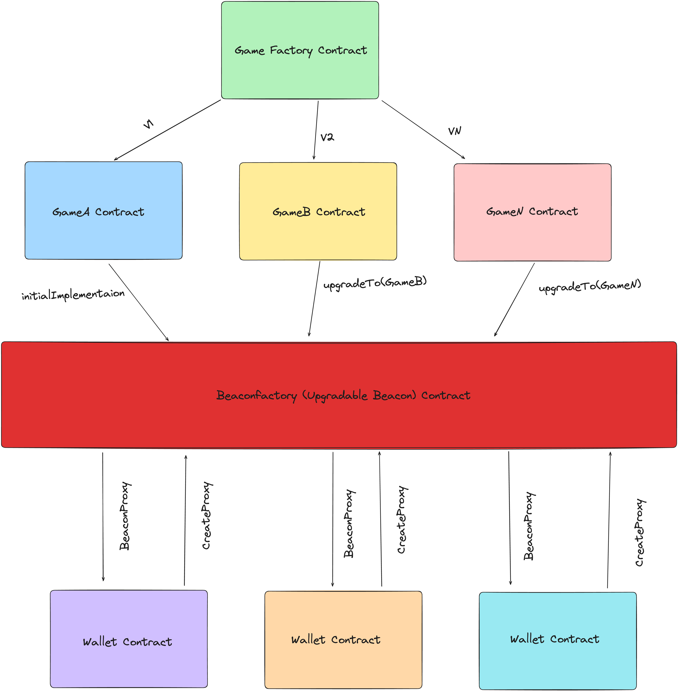

# Game BeaconProxy Proof of Concept (POC)

This repository demonstrates a Proof of Concept (POC) for implementing the BeaconProxy pattern in a gaming context. It is inspired by the article from [RareSkills](https://www.rareskills.io/post/beacon-proxy).

## Overview

The core idea is illustrated by the diagram below:



In this example, we have a game (e.g., "Mario") and wallets that can be owned by multiple users. Each wallet requires an instance of the `Game` contract, which allows its owners to interact with the game's functionality. A `BeaconFactory` contract is responsible for creating beacons, which point to the current implementation of the `Game` contract.

This pattern is beneficial because we only need to set the address of the beacon once. Any subsequent upgrades to the game logic will propagate to all wallet instances, as each beacon references the latest implementation of the `Game`. This allows for the creation of a large number of wallets, all utilizing the same beacon instance created by the `BeaconFactory`.

### Caveat

However, this approach can be risky. As demonstrated in the unit tests, if the game contract is accidentally upgraded to an arbitrary or faulty contract, every user will be affected. This underscores the importance of catching such errors quickly.

Should you use the BeaconProxy pattern? In my opinion, no. While it may seem advantageous, the added complexity and potential cascading errors make it less suitable for most use cases. For most scenarios, patterns like UUPS or Transparent Proxy offer sufficient flexibility without the same level of risk.

## Installation and Usage

### Foundry

This project uses Foundry, a high-performance toolkit for Ethereum development, written in Rust.

Foundry includes the following tools:

- **Forge**: A testing framework for Ethereum, similar to Truffle, Hardhat, and DappTools.
- **Cast**: A command-line tool for interacting with EVM smart contracts, sending transactions, and retrieving on-chain data.
- **Anvil**: A local Ethereum node, similar to Ganache and Hardhat Network.
- **Chisel**: A fast and interactive Solidity REPL.

### Documentation

For detailed Foundry documentation, visit: [Foundry Book](https://book.getfoundry.sh/)

### Running Tests

To run the tests, use the following command:

```bash
forge clean && forge test -vvvv
```

Running reverting tests

```bash
forge clean; forge test --match-path ./test/GameReverts.t.sol -vvvvv
```

Running positive tests

```bash
forge clean; forge test --match-path ./test/Game.t.sol -vvvvv
```

This repo is created for learning purposes none of the code should be taken seriously
